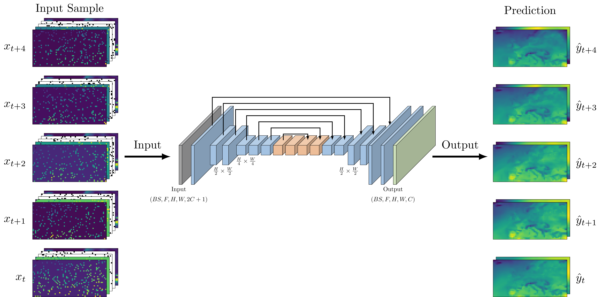

# WeRec3D




## Install requirements and venv
This description is targeted for MacOS or Linux operating systems and uses Python3.11. 
Unless otherwise stated, shell commands assume to be executed in the src/ directory.

Make sure piptools is installed
```
pip3.11 install pip-tools
pip3.11 install ipykernel
```
Create requirements file
```
cd requirements/
make requirements.txt
```

Create venv
```
python3.11 -m venv venv_werec3d
```
Activate venv
```
source venv_werec3d/bin/activate
```
Update
```
pip install --upgrade pip
```
To deactivate later:
```
deactivate
```
Execute outside of venv:
```
python3.11 -m ipykernel install --user --name=venv_werec3d
```

Install requirements to venv:
Pip-sync will install/update/uninstall everything to match the things defined in requirements.txt
(Execute outside of venv)
```
# Locally
pip-sync --python-executable venv_werec3d/bin/python requirements/requirements.txt
```


## Procedure for reproducibility
1. Obtain and prepare ERA5 Data from the very scratch. As the necessary files created in this step are added to the git repo, one can skip it and proceed with step 2.
```
cd data_source/
python download_create_daymean_sets.py -k <uid:key>
python reduce_size_granularity.py
# Download ETOPO1_Ice_g_geotiff.tif, save it to src/data_source/elevation/ETOPO1_Ice_g_geotiff.tif
# https://www.ngdc.noaa.gov/mgg/global/relief/ETOPO1/data/ice_surface/grid_registered/georeferenced_tiff/
python create_elevation_data.py
python create_land_sea_mask.py
```
2. Create climatology and anomaly data.
```
mkdir temporal_adjusted
python adjust_temporal.py
```
3. Create train, validation and test data:
```
# Go to preprocessing folder
python create_tvt_split.py
python mask_creation.py --missing_mechanism mcar
python mask_creation.py --missing_mechanism mnar
python create_ymean_sets.py
```
4. Run all experiments. This may take several days!
```
# Go to experiments_evaluation/
python run_all_experiments.py
```
5. Run the jupyter notebooks:
* 01_compare_experiment_runs.ipynb
* 02_create_val_preds_and_errors.ipynb
* 03_spatial_temporal_val.ipynb
* 04_validate_on_anomalies.ipynb
6. Create Analogue Resampling Method metadata
```
# In arm/
python create_weather_types.py
```
7. Validate on test data set
```
# In validation_on_test_set
python a1_create_arm_data.py
``` 
Run notebooks:
* investigate_analog_quality.ipynb (optional)
* validate_nmar_adjusted.ipynb
* validate_arm_enhanced.ipynb
* validate_arm_wt_enhanced.ipynb
8. Infere on year 1807

Prepare data:
```
python a0_create_metadata_1807.py
python a1_create_inference_1807_data.py
python a2_create_analogs.py
```
Model data:
```
python reconstruct_historic_weather.py -r full -m plain   
python reconstruct_historic_weather.py -r full -m arm                   
python reconstruct_historic_weather.py -r full -m arm_wt                
python reconstruct_historic_weather.py -r loo -m plain                  
python reconstruct_historic_weather.py -r loo -m arm                    
python reconstruct_historic_weather.py -r loo -m arm_wt
```
Validate by running the notebooks:
* validate_plain.ipynb
* validate_arm.ipynb
* validate_arm_wt.ipynb
